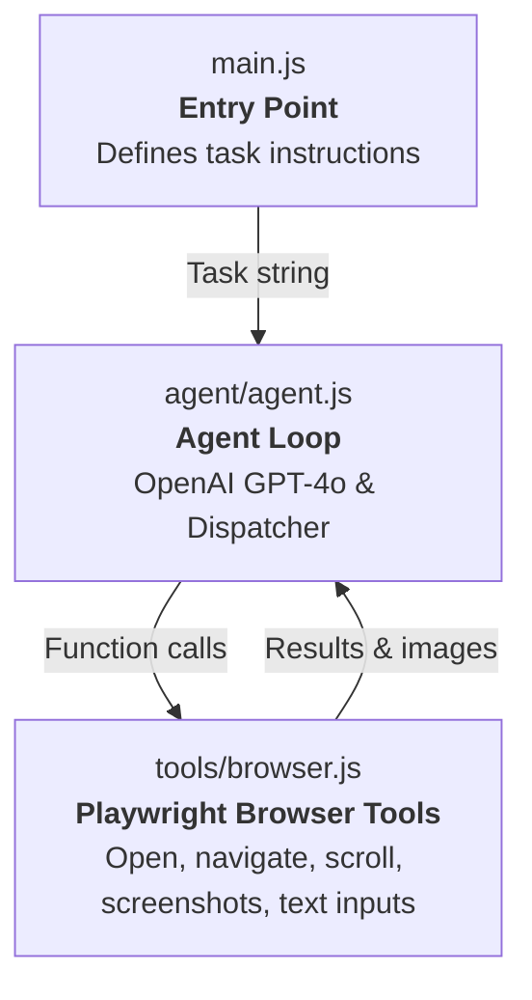
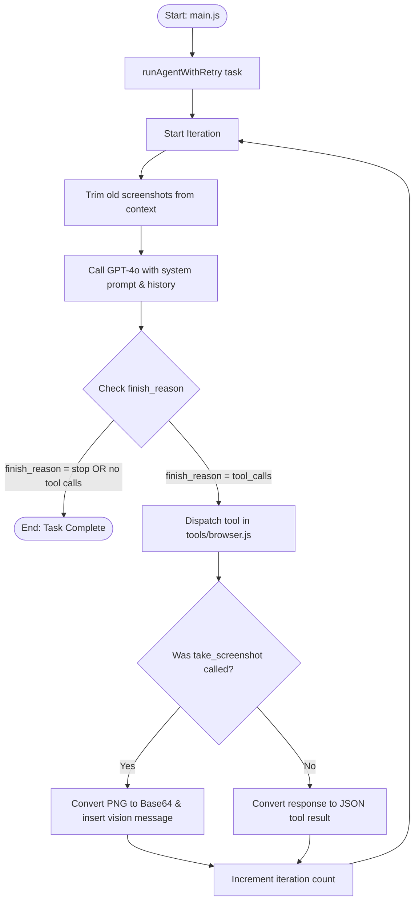
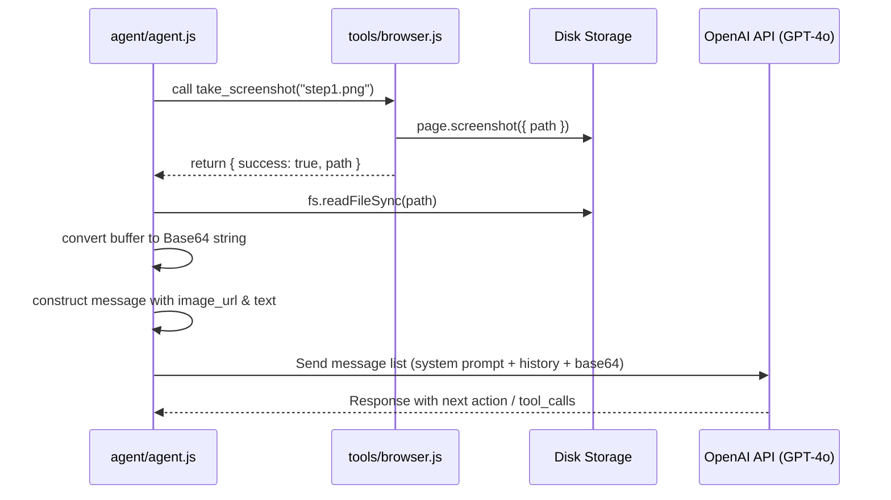

# 🏛️ Website Automation Agent Architecture

This document describes the architectural layout, data flow, and design decisions utilized in the Website Automation Agent.

---

  
  
  

---

## 🗺️ System Design Overview

The application is structured as a **tool-calling agent loop**. In this pattern, the AI model makes decisions on what actions to take, a dispatch mechanism executes those actions through browser automation, and the output is fed back to the AI model to inform the next iteration.

The project maintains a strict separation of concerns across three layers:

---

## 🔁 Agent Loop Workflow

The workflow below illustrates the step-by-step cycle the agent executes on every run.

---

## 💡 Key Design Decisions

### 1. Shared Browser State
> [!NOTE]
> The `browser` and `page` references are maintained as module-level variables within [browser.js](file:///home/x002/Desktop/Website%20Automation%20Agent/tools/browser.js) rather than being passed as arguments. This allows any utility function to reuse the active session seamlessly.
> * **Trade-off**: Supports only a single browser session at a time, which is perfect for this single-agent scope and keeps context/dependency threading extremely simple.

### 2. Vision-Based Decision Making
> [!TIP]
> GPT-4o is a vision-capable LLM. Every time the agent executes a screenshot tool call, the resulting PNG is converted to Base64 and appended as an image-url message. This allows the model to "see" page state, verify page layouts visually, and confirm whether actions succeeded.

### 3. CSS Selectors Over Pixel Coordinates
> [!IMPORTANT]
> To enter text, `send_keys` targets elements via stable CSS selectors (e.g. `textarea[name="bio"]`) rather than absolute screen coordinates. Screen coordinates break across different viewports or scroll positions, whereas CSS selectors remain stable.

### 4. Non-Throwing Tool Errors
> [!WARNING]
> If a CSS selector fails inside `send_keys`, the function returns `{ success: false, error: "..." }` rather than throwing an exception. Returning the error as a tool result allows the LLM to inspect the error message and autonomously retry with an alternative selector, instead of crashing the run.

### 5. Smart HTML Truncation
> [!TIP]
> Full page HTML markup from modern React applications can exceed 1M+ characters. To save tokens and stay within LLM context window boundaries, [get_page_content](file:///home/x002/Desktop/Website%20Automation%20Agent/tools/browser.js) extracts only interactive/form-related tags (e.g. `input`, `textarea`, `button`, `select`) and truncates the string to 8,000 characters.

### 6. Per-Run Logging & Traceability
> [!NOTE]
> Each run generates a clean, timestamped trace file under `logs/`. The logger prints color-coded, labeled outputs to the console for development and simultaneously logs plain-text lines to the disk for persistence.

---

## 📸 Vision Data Flow (Screenshots)

This diagram shows how screenshots are captured, processed, and fed back to GPT-4o to provide visual perception:

---

## 🗂️ File Architecture & Responsibilities

| File | Primary Responsibility |
|---|---|
| [main.js](file:///home/x002/Desktop/Website%20Automation%20Agent/main.js) | Defines the target task instructions. Root executor. |
| [agent/agent.js](file:///home/x002/Desktop/Website%20Automation%20Agent/agent/agent.js) | Stores tool schemas, coordinates the loop, handles API errors, and dispatches actions. |
| [tools/browser.js](file:///home/x002/Desktop/Website%20Automation%20Agent/tools/browser.js) | Manages Playwright page instances, selectors, keyboard inputs, and screenshot functions. |
| [utils/logger.js](file:///home/x002/Desktop/Website%20Automation%20Agent/utils/logger.js) | Handles colorized stdout mapping and log file streaming. |
| [test-setup.js](file:///home/x002/Desktop/Website%20Automation%20Agent/test-setup.js) | Serves as a diagnostic test to confirm Playwright and Chromium are fully operational. |

---

## ⚙️ Extending the Architecture

### To Add a New Browser Action:
1. Open [tools/browser.js](file:///home/x002/Desktop/Website%20Automation%20Agent/tools/browser.js) and implement your Playwright function, then export it.
2. In [agent/agent.js](file:///home/x002/Desktop/Website%20Automation%20Agent/agent/agent.js), define its parameter schema in `TOOL_DEFINITIONS`.
3. Add a matching case in the `dispatch_tool` switch block to trigger the tool function.

No modifications to the core agent loop or system prompts are needed.